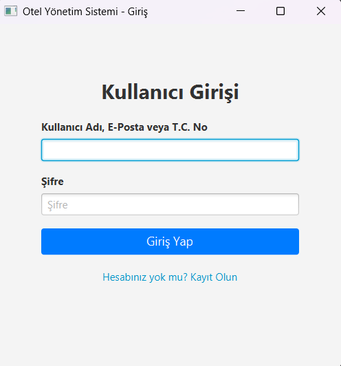
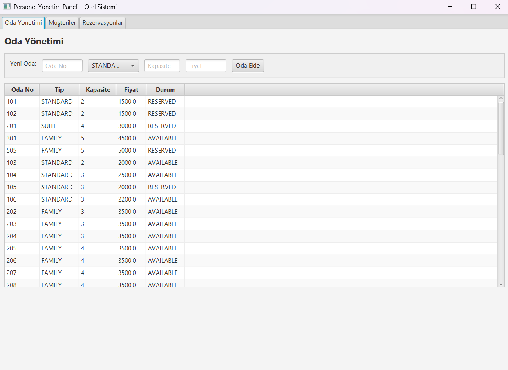
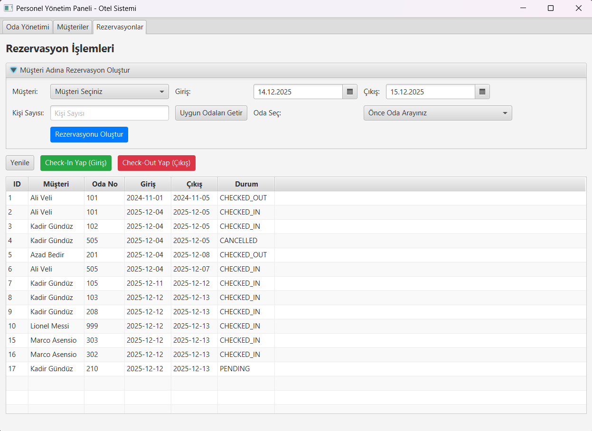
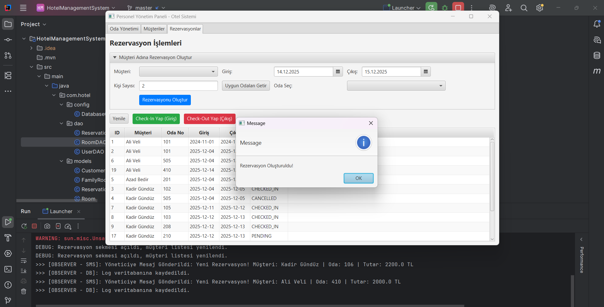

# 🏨 Hotel Management System (Otel Yönetim Sistemi)


JavaFX ve MySQL kullanılarak geliştirilmiş, **Yazılım Tasarım Desenleri (Design Patterns)** ile güçlendirilmiş, ölçeklenebilir ve modüler bir Otel Yönetim Otomasyonu.

---

## 📖 İçindekiler
- [Proje Hakkında](#-proje-hakkında)
- [Özellikler](#-özellikler)
- [Kullanılan Teknolojiler](#-kullanılan-teknolojiler)
- [Yazılım Mimarisi ve Tasarım Desenleri](#-yazılım-mimarisi-ve-tasarım-desenleri)
- [Veritabanı Yapısı](#-veritabanı-yapısı)
- [Kurulum ve Çalıştırma](#-kurulum-ve-çalıştırma)
- [Ekran Görüntüleri](#-ekran-görüntüleri)

---

## 🚀 Proje Hakkında
Bu proje, bir otelin günlük operasyonlarını (rezervasyon, oda yönetimi, müşteri takibi) dijitalleştirmek amacıyla geliştirilmiştir. Sistem, **Yönetici (Admin)** ve **Müşteri (Customer)** olmak üzere iki farklı rolü destekler.

Projenin temel amacı sadece çalışan bir yazılım yapmak değil; **Singleton, Factory, Observer, DAO** gibi endüstri standardı tasarım desenlerini kullanarak **bakımı kolay (maintainable)** ve **geliştirilebilir** bir mimari kurmaktır.

---

## ✨ Özellikler

### 👨‍💼 Yönetici (Personel) Paneli
- **Oda Yönetimi:** Yeni oda ekleme, silme, güncelleme (Standart, Suit, Aile odaları).
- **Rezervasyon Takibi:** Tüm rezervasyonları listeleme ve durumlarını yönetme.
- **Akıllı Arama:** Müşterileri İsim, TC No, Telefon veya Kullanıcı Adı ile filtreleme.
- **Log Sistemi:** Yapılan işlemleri anlık olarak izleme (Observer Pattern).

### 👤 Müşteri Paneli
- **Oda Arama:** Tarih aralığına ve kişi sayısına göre uygun oda sorgulama.
- **Sıralama:** Odaları kapasiteye ve fiyata göre akıllı sıralama.
- **Rezervasyon Yapma:** Seçilen odayı rezerve etme ve geçmiş rezervasyonları görüntüleme.

---

## 🛠 Kullanılan Teknolojiler

| Teknoloji | Açıklama |
|-----------|----------|
| **Dil** | Java 17+ |
| **Arayüz** | JavaFX (FXML & CSS) |
| **Veritabanı** | MySQL |
| **Veri Erişimi** | JDBC & DAO Pattern |
| **IDE** | IntelliJ IDEA / Eclipse |
| **Build Tool** | Maven / Gradle (Opsiyonel) |

---

## 🏗 Yazılım Mimarisi ve Tasarım Desenleri

Projede **Layered Architecture (Katmanlı Mimari)** kullanılmıştır.

### 1. Singleton Pattern 🔒
Veritabanı bağlantısı (`DatabaseConnection`) ve Bildirim Yöneticisi (`NotificationManager`) için kullanıldı. Böylece sistem genelinde tek bir bağlantı nesnesi garanti altına alındı.

### 2. Factory Pattern 🏭
`RoomFactory` sınıfı kullanılarak; Standart, Suit ve Aile odası gibi farklı nesnelerin üretim süreci soyutlandı. Yeni bir oda tipi eklendiğinde ana kod bozulmaz.

### 3. Observer Pattern 👀
Rezervasyon yapıldığında sistemin farklı birimlerini (Log sistemi, SMS simülasyonu) uyarmak için kullanıldı. `NotificationManager` tetiklendiğinde tüm `Observer`lar (Gözlemciler) haberdar olur.

### 4. DAO (Data Access Object) Pattern 💾
Veritabanı işlemleri (`UserDAO`, `RoomDAO`, `ReservationDAO`) iş mantığından tamamen ayrılarak kodun okunabilirliği artırıldı.

---

## 🗄 Veritabanı Yapısı (ER Diagram)

Proje ilişkisel veritabanı yapısına sahiptir:
- **Users:** Kullanıcı bilgileri ve rolleri.
- **Rooms:** Oda özellikleri, fiyatları ve durumu.
- **Reservations:** Müşteri ve oda arasındaki bağlantı (N-to-N relation).
- **Logs:** Sistem hareketlerinin kaydı.

> *(Buraya çizdiğin ER diyagramının görselini koyabilirsin)*
> ``

---

## 📸 Ekran Görüntüleri

### 1. Giriş Ekranı


### 2. Personel Yönetim Paneli


### 3. Rezervasyon Oluşturma (Akıllı Sıralama)


### 4. Log ve Bildirim Sistemi


---

## ⚙️ Kurulum ve Çalıştırma

Projeyi yerel makinenizde çalıştırmak için adımları izleyin:

**1. Projeyi Klonlayın**
```bash
git clone [https://github.com/kullaniciadi/HotelManagementSystem.git](https://github.com/kullaniciadi/HotelManagementSystem.git)
